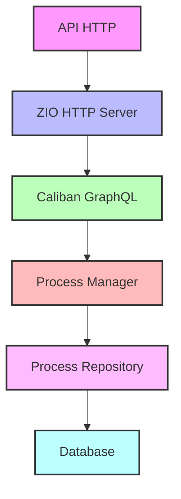
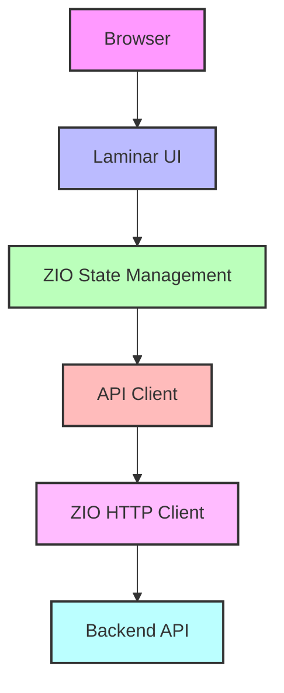

# Yeye - Gerenciador de Processos

Aplicação web para gerenciamento de processos, desenvolvida com Scala no backend e Scala.js no frontend.

## Arquitetura

### Backend


### Frontend


## Stack Tecnológica

### Backend
- Scala 3.3.1
- ZIO - Para programação assíncrona e concorrente
- Cats - Para programação funcional e abstrações
- Caliban - Para GraphQL
- ZIO HTTP - Para servidor HTTP

### Frontend
- Scala.js - Para compilação do Scala para JavaScript
- ZIO - Para gerenciamento de estado e efeitos
- Cats - Para programação funcional no frontend
- Laminar - Para UI reativa
- ZIO JSON - Para serialização JSON

## Requisitos

- JDK 11 ou superior
- SBT (Scala Build Tool) 1.10.11 ou superior

## Configuração do Ambiente

1. Clone o repositório:
```bash
git clone [URL_DO_REPOSITÓRIO]
cd yeye
```

2. Instale as dependências:
```bash
sbt update
```

3. Para desenvolvimento:
```bash
# Terminal 1 - Servidor de Desenvolvimento
sbt 'devServer/runMain com.yeye.devserver.DevServer'
```

O servidor estará disponível em:
- Interface Web: http://localhost:8080/index.html
- API REST: http://localhost:8080/
- GraphQL Endpoint: http://localhost:8080/api/graphql

## API Endpoints

### REST API
- `GET /processes` - Lista todos os processos
- `GET /users` - Lista todos os usuários
- `GET /users/:id` - Obtém um usuário específico
- `POST /users` - Cria um novo usuário
- `PUT /users/:id` - Atualiza um usuário existente
- `DELETE /users/:id` - Remove um usuário

### GraphQL API
- Endpoint: `/api/graphql`
- Método: POST
- Content-Type: application/json

## Estrutura do Projeto

```
yeye/
├── backend/           # Aplicação backend
│   ├── src/main/scala
│   └── src/main/resources
├── frontend/          # Aplicação frontend
│   ├── src/main/scala
│   └── src/main/resources
├── shared/            # Código compartilhado entre backend e frontend
│   └── src/main/scala
└── devServer/         # Servidor de desenvolvimento
    └── src/main/scala
```

## Funcionalidades

- Gerenciamento de processos
- Interface web responsiva
- API GraphQL
- API REST
- Comunicação em tempo real (se necessário)

## Tecnologias Principais

- **Backend**
  - ZIO: Para programação assíncrona e concorrente
  - Cats: Para programação funcional e abstrações
  - Caliban: Para API GraphQL
  - ZIO HTTP: Para servidor HTTP

- **Frontend**
  - Scala.js: Para compilação do Scala para JavaScript
  - Laminar: Para UI reativa
  - ZIO: Para gerenciamento de estado
  - ZIO JSON: Para serialização JSON

## Contribuindo

1. Faça um fork do projeto
2. Crie uma branch para sua feature (`git checkout -b feature/nova-feature`)
3. Commit suas mudanças (`git commit -m 'Adiciona nova feature'`)
4. Push para a branch (`git push origin feature/nova-feature`)
5. Abra um Pull Request

## Licença

[Inserir licença aqui] 