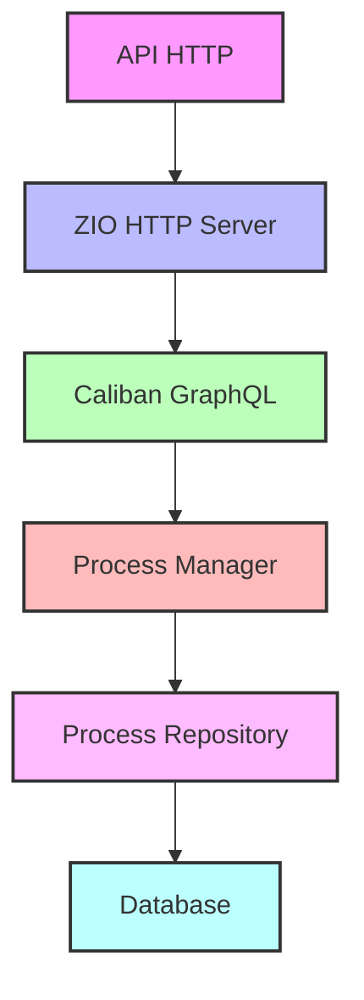
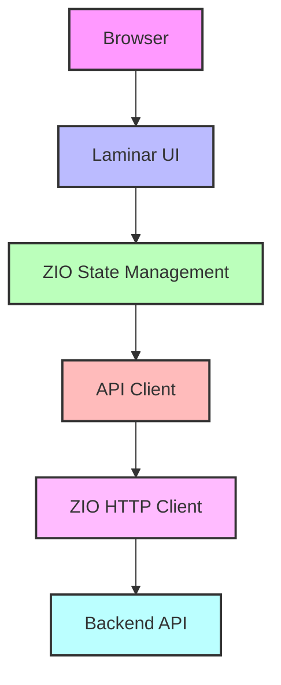

# Yeye - Process Manager

Web application for process management, developed with Scala on the backend and Scala.js on the frontend.

## Architecture

### Backend


### Frontend


## Technology Stack

### Backend
- Scala 3.3.1
- ZIO - For asynchronous and concurrent programming
- Cats - For functional programming and abstractions
- Caliban - For GraphQL
- ZIO HTTP - For HTTP server

### Frontend
- Scala.js - For Scala to JavaScript compilation
- ZIO - For state management and effects
- Cats - For functional programming in the frontend
- Laminar - For reactive UI
- ZIO JSON - For JSON serialization

## Requirements

- JDK 11 or higher
- SBT (Scala Build Tool) 1.10.11 or higher
- Podman (for containerized deployment)

## Environment Setup

1. Clone the repository:
```bash
git clone [REPOSITORY_URL]
cd yeye
```

2. Install dependencies:
```bash
sbt update
```

3. For development:
```bash
# Terminal 1 - Development Server
sbt 'devServer/runMain com.yeye.devserver.DevServer'
```

The server will be available at:
- Web Interface: http://localhost:8080/index.html
- REST API: http://localhost:8080/
- GraphQL Endpoint: http://localhost:8080/api/graphql

## Containerized Deployment with Podman

### Single Instance Deployment
1. Build and start the services:
```bash
podman compose -f docker/docker-compose.yml up
```

### Replicated Deployment
To run multiple instances of the application:

1. Create a network for the services:
```bash
podman network create yeye-network
```

2. Start the Oracle database:
```bash
podman run -d --name oracle --network yeye-network \
  -e ORACLE_PASSWORD=ora \
  -e APP_USER=system \
  -e APP_USER_PASSWORD=ora \
  gvenzl/oracle-free:latest
```

3. Start multiple backend instances:
```bash
# Instance 1
podman run -d --name backend-1 --network yeye-network \
  -e DB_URL=jdbc:oracle:thin:@//oracle:1521/FREE \
  -e DB_USER=system \
  -e DB_PASSWORD=ora \
  -p 8081:8081 \
  yeye-backend

# Instance 2
podman run -d --name backend-2 --network yeye-network \
  -e DB_URL=jdbc:oracle:thin:@//oracle:1521/FREE \
  -e DB_USER=system \
  -e DB_PASSWORD=ora \
  -p 8082:8081 \
  yeye-backend
```

4. Start the Nginx load balancer:
```bash
podman run -d --name nginx --network yeye-network \
  -p 8080:80 \
  -v ./docker/nginx/nginx.conf:/etc/nginx/nginx.conf:ro \
  nginx:latest
```

## API Endpoints

### GraphQL API
- Endpoint: `/api/graphql`
- Method: POST
- Content-Type: application/json

Available operations:
- Queries:
  - `users`: List all users
  - `userById(id: String)`: Get a specific user
- Mutations:
  - `createUser(input: CreateUserInput)`: Create a new user
  - `updateUser(input: UpdateUserInput)`: Update an existing user
  - `deleteUser(id: String)`: Delete a user

### Health Check
- Endpoint: `/internal/health`
- Method: GET
- Returns: 200 OK if the service is healthy, 503 Service Unavailable otherwise

## Project Structure

```
yeye/
├── backend/           # Backend application
│   ├── src/main/scala
│   └── src/main/resources
├── frontend/          # Frontend application
│   ├── src/main/scala
│   └── src/main/resources
├── shared/            # Code shared between backend and frontend
│   └── src/main/scala
├── devServer/         # Development server
│   └── src/main/scala
└── docker/            # Container configuration
    ├── backend/
    │   └── Dockerfile
    ├── nginx/
    │   └── nginx.conf
    └── docker-compose.yml
```

## Features

- Process management
- Responsive web interface
- GraphQL API
- REST API
- Real-time communication (if needed)
- Containerized deployment
- Horizontal scaling support

## Main Technologies

- **Backend**
  - ZIO: For asynchronous and concurrent programming
  - Cats: For functional programming and abstractions
  - Caliban: For GraphQL API
  - ZIO HTTP: For HTTP server

- **Frontend**
  - Scala.js: For Scala to JavaScript compilation
  - Laminar: For reactive UI
  - ZIO: For state management
  - ZIO JSON: For JSON serialization

## Contributing

1. Fork the project
2. Create a feature branch (`git checkout -b feature/new-feature`)
3. Commit your changes (`git commit -m 'Add new feature'`)
4. Push to the branch (`git push origin feature/new-feature`)
5. Open a Pull Request

## License

MIT License

Copyright (c) 2024 Yeye

Permission is hereby granted, free of charge, to any person obtaining a copy
of this software and associated documentation files (the "Software"), to deal
in the Software without restriction, including without limitation the rights
to use, copy, modify, merge, publish, distribute, sublicense, and/or sell
copies of the Software, and to permit persons to whom the Software is
furnished to do so, subject to the following conditions:

The above copyright notice and this permission notice shall be included in all
copies or substantial portions of the Software.

THE SOFTWARE IS PROVIDED "AS IS", WITHOUT WARRANTY OF ANY KIND, EXPRESS OR
IMPLIED, INCLUDING BUT NOT LIMITED TO THE WARRANTIES OF MERCHANTABILITY,
FITNESS FOR A PARTICULAR PURPOSE AND NONINFRINGEMENT. IN NO EVENT SHALL THE
AUTHORS OR COPYRIGHT HOLDERS BE LIABLE FOR ANY CLAIM, DAMAGES OR OTHER
LIABILITY, WHETHER IN AN ACTION OF CONTRACT, TORT OR OTHERWISE, ARISING FROM,
OUT OF OR IN CONNECTION WITH THE SOFTWARE OR THE USE OR OTHER DEALINGS IN THE
SOFTWARE. 